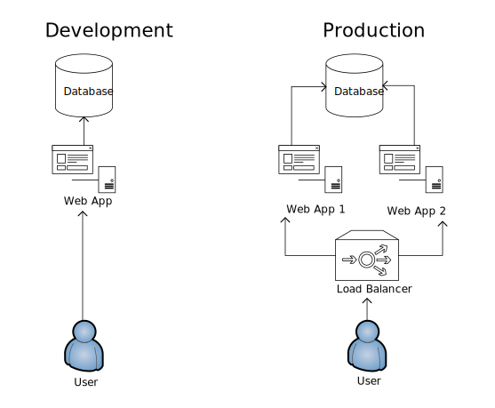

# Exercise 4
**Legacy Deployment**

Given the below system and release process
- what issues can you forsee
- what can be improved/how can these issues be mitigated

### System:
**Environments:**

**Live**
- 1 Database
- 2 VMs hosting website
- 1 load balancer

**Dev**
- 1 Database
- 1 VM hosting website

### Deployment Process:
1. Open Database comparison tool
	1. Compare Dev database to Prod Database  
	1. Make a copy of all sql scripts required to update Prod’s schema
1. Run generated scripts against Prod DB
1. If needed add any required Data to changed tables from pre-prepared sql script
1. Route all normal traffic to Web App 1 in load balancer
1. Route all traffic from developers' machines to Web App 2
1. Remote into Web App 2
   1. Create a zip backup of old code
   1. Copy up new published code
   1. Run manual tests against Web App 2
1. If Web app 2 is working
	1. Route all normal traffic to Web App 2 in load balancer
    1. Route all dev traffic to Web App 1
    1. Repeat step 6 to Web App 1
1. If Web App 2 is not working
   1. Delete new files
   1. Copy old files back
   1. Check app is working
1. Revert load balancer to normal configuration of splitting traffic
